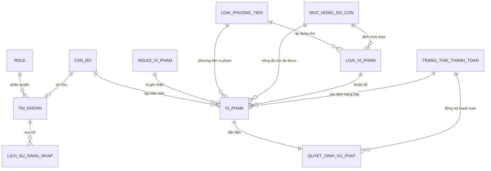

# 🚥 HỆ THỐNG QUẢN LÝ VI PHẠM GIAO THÔNG (TRAFFIC VIOLATION MANAGEMENT)
> **Đồ án môn học:** Phân tích Thiết kế Hướng đối tượng (PTTKHDT)
> Một ứng dụng Web hiện đại giúp số hóa quy trình quản lý, xử phạt và tra cứu vi phạm giao thông đường bộ dành cho Cảnh sát Giao thông (CSGT), Người dân và Quản trị viên hệ thống.

---

<p align="center">
  
  
  
  
  
  
</p>

---

## 🌟 Tính Năng Nổi Bật

Hệ thống được chia thành 3 cổng thông tin nghiệp vụ độc lập, tối ưu trải nghiệm người dùng:

### 👤 1. Cổng Tra Cứu Dành Cho Người Dân (`search.html`)
- **Tra cứu nhanh chóng:** Nhập số **Căn cước Công dân (CCCD)** để tìm kiếm tức thời các lỗi vi phạm đã lưu trên hệ thống.
- **Chi tiết vi phạm:** Hiển thị chi tiết thời gian, địa điểm, lỗi vi phạm, nồng độ cồn đo được, biển số xe, số tiền phạt và cán bộ lập biên bản.
- **Trạng thái nộp phạt:** Theo dõi thời gian thực trạng thái đóng phạt (`Đã thanh toán`, `Chưa thanh toán`, `Quá hạn`).

### 👮 2. Phân Hệ Dành Cho Cán Bộ Xử Lý Vi Phạm (`officer.html`)
- **Quản lý danh sách biên bản:** Xem, lọc và tìm kiếm toàn bộ hồ sơ vi phạm giao thông trên địa bàn.
- **Lập biên bản vi phạm:**
  - Nhập thông tin người lái xe, biển số, nồng độ cồn, địa điểm và thời gian.
  - Tự động phân loại phương tiện (`Xe máy`, `Ô tô`, `Xe tải`, `Xe khách`) và khớp mức nồng độ cồn tương ứng theo quy định pháp luật.
- **Ra quyết định xử phạt:** Tự động tính số tiền phạt từ cấu hình loại vi phạm và cấp quyết định xử phạt.
- **Cập nhật trạng thái đóng phạt:** Đánh dấu biên bản sau khi người dân hoàn thành nghĩa vụ tài chính.
- **Danh mục vi phạm:** Xem và cập nhật định mức phạt cho từng loại lỗi.

### 🛡️ 3. Phân Hệ Quản Trị Hệ Thống Dành Cho Admin (`admin.html`)
- **Bảng điều khiển trực quan (Dashboard Analytics):** Thống kê số liệu trực tiếp (Tổng số biên bản, Tổng doanh thu phạt, Số tài khoản cán bộ, Số lượng người vi phạm, Biểu đồ tỉ lệ đóng phạt).
- **Quản lý Cán bộ (Officers):** Thêm mới, chỉnh sửa thông tin hồ sơ và quản lý phân đơn vị công tác của Cán bộ CSGT.
- **Cấp tài khoản & Phân quyền:**
  - Cấp tài khoản đăng nhập cho cán bộ mới.
  - Bật/Khóa trạng thái hoạt động của tài khoản để đảm bảo an ninh hệ thống.

---

## 🛠️ Công Nghệ & Kiến Trúc Sử Dụng

### 🌐 Backend
- **Node.js** kết hợp **Express.js** cung cấp RESTful APIs chất lượng cao.
- Tổ chức mã nguồn chặt chẽ theo mô hình thiết kế **MVC (Model - View - Controller)**.
- Kết nối Cơ sở dữ liệu pooling hiệu năng cao thông qua thư viện `mysql2`.

### 🗄️ Database (MySQL) - Thiết Kế Ràng Buộc Nâng Cao
Cơ sở dữ liệu được tích hợp sẵn các nghiệp vụ tự động thông qua **Triggers** và **Stored Procedures** nhằm toàn vẹn dữ liệu ở mức tối đa:
- **Triggers kiểm tra điều kiện (Data Integrity Triggers):**
  - `trg_KiemTraNgaySinh_NVP`: Ràng buộc người vi phạm phải từ **16 tuổi trở lên** và nhỏ hơn **120 tuổi**.
  - `trg_KiemTraBienSo`: Tự động kiểm tra định dạng biển số xe theo loại phương tiện bằng Regex (Xe máy: `99A9-999.99`, Ô tô/Xe tải/Xe khách: `99A-999.99`).
  - `trg_KiemTraNongDoCon`: Đảm bảo nồng độ cồn nhập vào phải nằm đúng khoảng định mức của mã mức nồng độ cồn đã chọn.
  - `trg_CapNhatSoTienPhat`: Tự động điền số tiền phạt dựa trên mức phạt mặc định của loại vi phạm khi lập quyết định xử phạt.
  - `trg_DongBoTrangThaiThanhToan`: Tự động đồng bộ trạng thái thanh toán giữa bảng `VI_PHAM` và `QUYET_DINH_XU_PHAT`.
- **Stored Procedures tối ưu hiệu suất:**
  - `sp_LayThongTinDangNhap`: Kiểm tra thông tin tài khoản đang hoạt động của cán bộ khi đăng nhập.
  - `sp_GhiLichSuDangNhap`: Ghi lại chi tiết lịch sử đăng nhập (thành công/thất bại, IP, thời gian) phục vụ kiểm toán bảo mật.
  - `sp_TraCuuViPhamTheoCCCD`: Hỗ trợ tối ưu hóa truy vấn kết hợp nhiều bảng (JOIN) khi người dân thực hiện tra cứu theo CCCD.

---

## 📊 Sơ Đồ Thực Thể Liên Kết (ERD)

Dưới đây là thiết kế mối quan hệ thực thể của cơ sở dữ liệu `QuanLyViPham`:



### Chi tiết các bảng chính:
- **`CAN_BO`**: Thông tin hồ sơ cán bộ chiến sĩ cảnh sát.
- **`TAI_KHOAN`**: Thông tin tài khoản đăng nhập nghiệp vụ.
- **`NGUOI_VI_PHAM`**: Hồ sơ công dân có hành vi vi phạm giao thông.
- **`VI_PHAM`**: Chi tiết vụ việc vi phạm được ghi nhận tại hiện trường.
- **`QUYET_DINH_XU_PHAT`**: Quyết định xử phạt tài chính dựa trên biên bản vi phạm.

---

## 📂 Cấu Trúc Mã Nguồn

```text
quanlyvipham_web/
├── public/                 # Giao diện người dùng frontend (Client side)
│   ├── css/                # Bộ mã phong cách CSS (Index stylesheet, UI)
│   ├── js/                 # Logic xử lý giao diện AJAX & DOM Manipulation
│   │   ├── admin.js        # Nghiệp vụ phân hệ Admin
│   │   └── officer.js      # Nghiệp vụ lập biên bản & xử phạt của Cán bộ
│   ├── admin.html          # Trang Dashboard & Quản lý Cán bộ
│   ├── login.html          # Trang Đăng nhập hệ thống
│   ├── officer.html        # Trang làm việc chính của Cán bộ CSGT
│   └── search.html         # Trang tra cứu vi phạm dành cho người dân
├── src/                    # Mã nguồn backend (Server side)
│   ├── config/             # Kết nối Database và file SQL Schema & Seed
│   │   ├── db.js           # Kết nối pool MySQL database
│   │   ├── mysql.sql       # File tạo bảng cấu trúc, Triggers và Stored Procedures
│   │   └── seed.sql        # Bộ dữ liệu mẫu dùng để chạy thử (Seeding data)
│   ├── controllers/        # Điều hướng logic và xử lý luồng dữ liệu
│   ├── middlewares/        # Bộ lọc kiểm soát lỗi và quyền truy cập
│   ├── models/             # Định nghĩa tương tác dữ liệu
│   ├── routes/             # Khai báo các điểm đầu cuối API (API Endpoints)
│   └── services/           # Xử lý nghiệp vụ phức tạp
├── .env                    # Biến cấu hình môi trường hệ thống
├── .gitignore              # Chỉ định các file không đẩy lên GitHub
├── package.json            # Quản lý dependencies & kịch bản chạy
└── server.js               # File khởi chạy máy chủ Express
```

---

## 🚀 Hướng Dẫn Cài Đặt & Khởi Chạy

Làm theo các bước đơn giản sau để thiết lập dự án trên môi trường cục bộ (Local):

### 📋 Yêu cầu hệ thống
- Cài đặt sẵn [Node.js](https://nodejs.org/) (Phiên bản v16 trở lên khuyên dùng).
- Cài đặt sẵn [MySQL Server](https://www.mysql.com/) (Phiên bản 8.0 trở lên).

### Bước 1: Tải mã nguồn về máy
```bash
git clone https://github.com/kimngan11/QuanLyViPham.git
cd QuanLyViPham
```

### Bước 2: Cài đặt các thư viện cần thiết
```bash
npm install
```

### Bước 3: Cấu hình Cơ sở dữ liệu MySQL
1. Khởi động MySQL Server của bạn.
2. Mở ứng dụng MySQL Workbench (hoặc DBeaver/Navicat/Command Line).
3. Chạy file script [mysql.sql](file:///e:/hoctap/PTTKHDT/quanlyvipham_web/src/config/mysql.sql) để tạo cơ sở dữ liệu, các bảng ràng buộc, Trigger và Stored Procedure.
4. Chạy file script [seed.sql](file:///e:/hoctap/PTTKHDT/quanlyvipham_web/src/config/seed.sql) để nạp các bộ dữ liệu mẫu (Cán bộ mẫu, Loại vi phạm quy định, Tài khoản Admin & Cán bộ, Vi phạm mẫu).

### Bước 4: Thiết lập file môi trường `.env`
Tạo file `.env` tại thư mục gốc của dự án và điền thông tin kết nối MySQL của bạn (hoặc chỉnh sửa trực tiếp file `.env` đã có):

```env
PORT=3000
DB_HOST=localhost
DB_USER=tên_đăng_nhập_mysql_của_bạn
DB_PASSWORD=mật_khẩu_mysql_của_bạn
DB_NAME=QuanLyViPham
```

### Bước 5: Khởi động Server
- **Chế độ phát triển (Development Mode - Auto reload với Nodemon):**
  ```bash
  npm run dev
  ```
- **Chế độ chạy chính thức (Production Mode):**
  ```bash
  npm start
  ```

Sau khi khởi chạy thành công, mở trình duyệt và truy cập:
- Cổng nghiệp vụ nội bộ (Login): `http://localhost:3000/login.html` (hoặc `http://localhost:3000/` tự động chuyển hướng).
- Cổng tra cứu dành cho người dân: `http://localhost:3000/search.html`

---

## 👥 Thành Viên Thực Hiện (Project Members)

| MSSV | Họ và Tên | Vai Trò trong Đồ Án |
| :--- | :--- | :--- |
| **B21XXXXX** | **Nguyễn Thị Kim Ngân** | Phát triển Frontend, Thiết kế CSDL & Backend logic |
| **B21XXXXX** | **Thành viên 2** | Kiểm thử, viết báo cáo & sơ đồ lớp đối tượng |

---
*Chúc bạn có trải nghiệm tuyệt vời với Hệ thống Quản lý Vi phạm Giao thông! Nếu thấy dự án hữu ích, hãy tặng tụi mình 1 🌟 Star trên GitHub nhé!*
